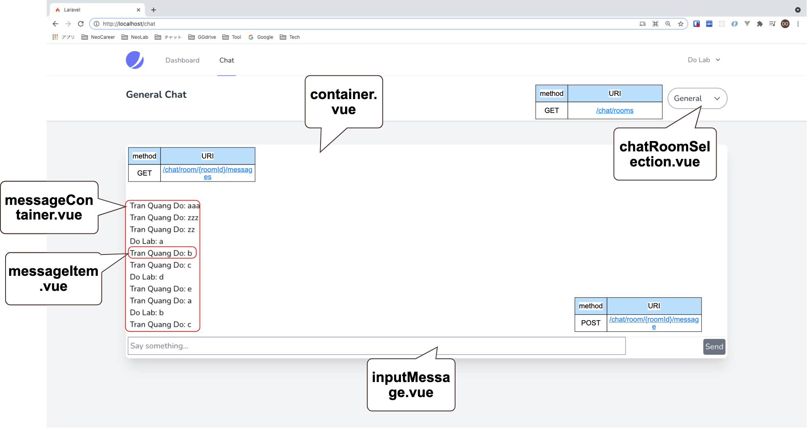
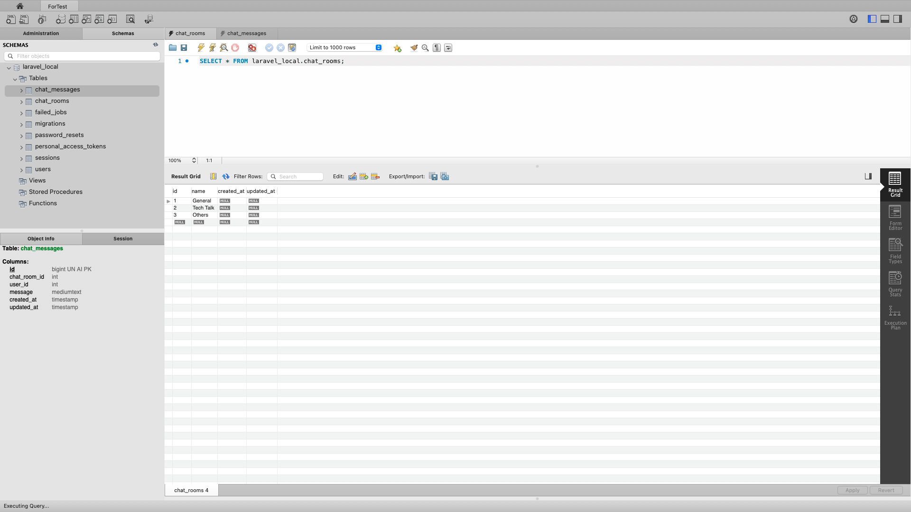
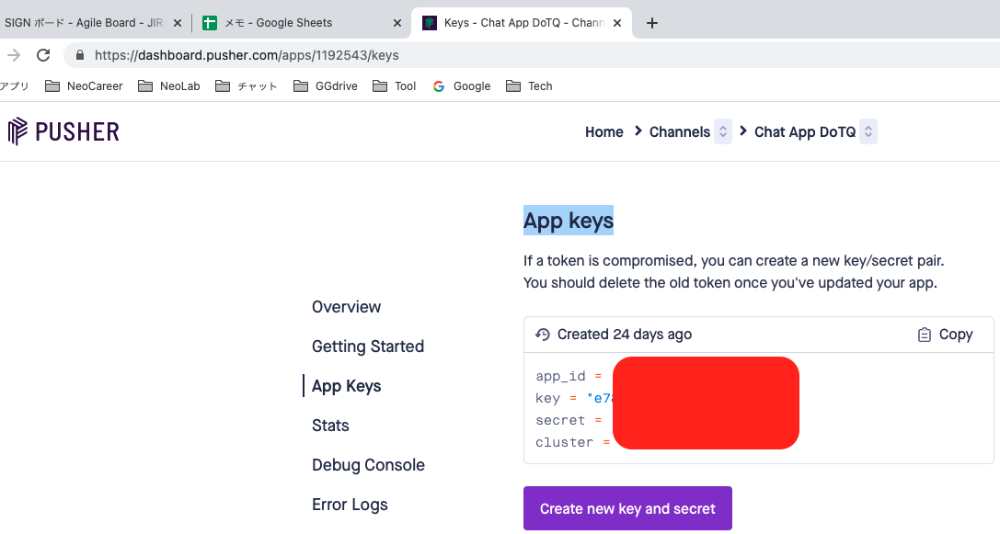
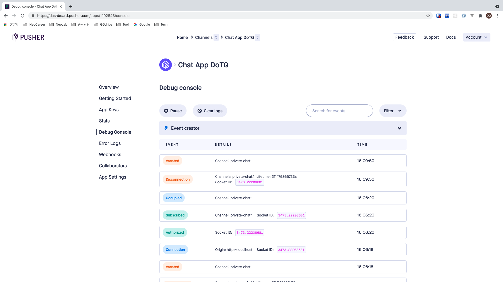

# BACKEND

## Install

- copy `.env.example` to `.env`
- `docker-compose exec app bash`
- `composer require laravel/sanctum`
- `php artisan vendor:publish --provider="Laravel\Sanctum\SanctumServiceProvider"`
- `composer require laravel/jetstream`
- `php artisan jetstream:install inertia`
- `php artisan key:generate`
- `php artisan migrate`
- `cd backend`
- `backend % npm i`
- `php artisan vendor:publish --tag=jetstream-views`
- `backend % npm run hot`

## Run

- access on browser: `http://localhost`


## MVC

- `php artisan make:model ChatRoom/ChatMessage -m`
- `php artisan migrate`

- `php artisan make:seeder ChatRoomSeeder`
- `php artisan db:seed`
- `php artisan make:controller ChatController`

## Pusher (login by github "trangia61@")

### api key
- setting these `.env`:
```shell
PUSHER_APP_ID=
PUSHER_APP_KEY=
PUSHER_APP_SECRET=
PUSHER_APP_CLUSTER=mt1
```


### install & user
- `composer require pusher/pusher-php-server "~4.0"`
- `backend % npm i --save laravel-echo pusher-js`
- `php artisan event:generate`
>clear cache
>- `php artisan optimize`
>- `php artisan queue:work`


## heroku
1. create `heroku.yml`
2. `heroku login`
3. commit `heroku.yml`
```bash
git add heroku.yml
git commit -m 'Add heroku.yml'
```
4. `heroku stack:set container`
5. `git push heroku main`
6. `heroku open`
